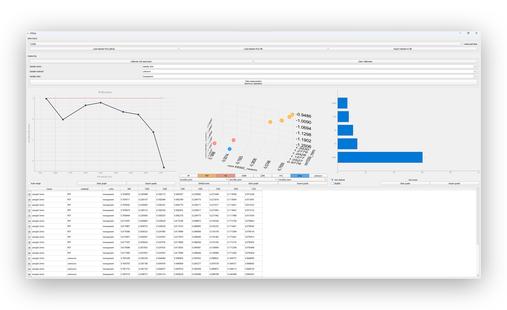

<div align="center">
  <a href="https://plasticscanner.com/">
    
  </a>
  
# PSplot
*A lightweight tool for obtaining and visualising the discrete near-infrared (NIR) data using the Plastic Scanner.*



> WARNING: still in early development, not a stable release! See GitHub [issues](https://github.com/Plastic-Scanner/PSplot/issues)
</div>


## Installation

Requires python >=3.8, pipenv
Install python dependencies (listed in Pipfile):
```
$ pipenv install
```

Start the shell and run the program:
```
$ pipenv shell
$ python psplot.py
```
Use `exit` or Ctrl+D to exit pipenv shell


## Usage
The interface is divided up in 3 sections
### Data in/out
Here you can select your developement board, if no COM port is available/selected it will use dummy data (to help the developers!)
You can also import or export data to load previous dataset or to export your data once you are done.

### Measuring
In this section you can:
- calibrate with reference material
- fill in details about (un)known sample 
- take a measurement

### Data visualisation
The last section shows the visualisation of the measurement. It has four sections
1. 2D spectrum graph, this shows the measurement from the sample, with the reference measurement as an ideal straight line and with the SNV applied. It shows the last 3 measurements
2. 3D scatter plot, this shows a 3D plot with the previous measurements. The colors are based on the "Sample Material" input. It defaults to the axis that we think are the most interesting, but with the drop down menus you can play around to see what works for you.
3. > WARNING: this is a first experiment! It is a bar chart, that shows what the computer thinks is the most likely type of plastic, this is at the moment only an experiment for HDPE, PET, PP and PS
4. Table with the raw measurement values. In this table you can also edit the material of a measurement after taking the measurement by editing one of cells.


## Contributing
Feel free to improve, modify and contribute to this project. It's part of the [Plastic Scanner](https://plasticscanner.com/) open source hardware development, check out the [docs](https://docs.plasticscanner.com/) as well!
